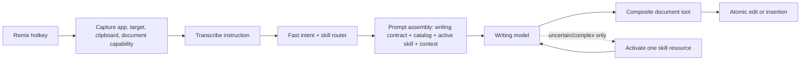

# Remix Writing Skills: Product and Pipeline Plan

Status: proposed  
Owner: Remix / writing experience  
Scope: desktop Remix agent, Freestyle Cloud Remix route, local BYOK parity  
Related: `specs/remix.md`, `apps/server/src/lib/editor/remix-prompts.ts` on
`upstream/remix-prototype`

## 1. Summary

Remix should become a general writing agent whose expertise changes with the
job while its interaction model stays constant:

> The cursor supplies the destination, a selection supplies the subject, and
> the user supplies the direction.

The same Remix hotkey supports both editing and drafting:

- Text selected: edit, critique, or otherwise act on that selection.
- Nothing selected: compose and insert at the cursor.
- Pure question: answer in the Remix surface without changing the document.
- Ambiguous target: inspect available context or ask one short question; never
  guess at destructive scope.

Writing expertise will come from reputable, permissively licensed third-party
Agent Skills. Freestyle owns the runtime around those skills: target capture,
routing, progressive loading, safe document tools, attribution, versioning,
and evaluation. Skills are vendored and pinned at build time. No third-party
skill or script is fetched or executed at runtime.

The key performance decision is progressive disclosure. Normal requests load
only a compact writing contract, a compact skill catalog, terse composite tool
schemas, and at most one primary skill. Detailed references load only when a
complex task needs them.

## 2. Goals

1. Make empty-cursor drafting feel like the natural other half of selection
   editing without adding another hotkey or mode switch.
2. Give Remix excellent domain-specific writing judgment across quick replies,
   email, professional writing, editing, long-form, academic, creative, and
   marketing work.
3. Keep authorship user-directed. Skills may advise and execute the requested
   operation, but must not silently broaden scope or advance to a new writing
   stage.
4. Reduce the standing prompt and the number of model-visible desktop
   primitives.
5. Use the same skill versions and behavior on Freestyle Cloud and local BYOK.
6. Make every shipped skill traceable to a source, commit, license, and eval
   result.

## 3. Non-goals

- A gallery of templates or a required writing-mode picker.
- A proprietary word processor.
- Loading every skill into every request.
- Letting third-party skills execute bundled scripts or choose unrestricted
  tools.
- Automatically sending messages, publishing work, or taking consequential
  external actions.
- Treating application name as authoritative intent. Gmail is evidence for an
  email task, not proof.
- Shipping an external skill based only on install count or GitHub stars.

## 4. Interaction contract

### 4.1 One hotkey, two affirmative target states

The hotkey continues to mean "Remix here." The target determines the behavior:

| Captured state | UI label | Default write behavior |
| --- | --- | --- |
| Non-empty selection | `Editing selection · 428 words` | Replace only the selected span |
| Empty selection/caret | `Writing at cursor` | Insert without replacing nearby text |
| Capture unavailable | `Couldn’t read selection` | Do not write until target is recovered or confirmed |

`No selection` should not appear as an error-like empty state. Empty selection
is a valid composition mode.

### 4.2 Selection capture must be tri-state

The current `string | null` shape conflates "nothing selected" with "capture
failed." Replace it with an explicit state:

```ts
type RemixSelectionState =
  | { status: "selected"; text: string }
  | { status: "empty" }
  | { status: "unavailable"; reason: string };
```

The agent may insert at the cursor only when status is `empty`. It must not
interpret `unavailable` as a blank target.

### 4.3 User-visible skill behavior

Skill routing is automatic by default. After the spoken instruction resolves,
the pill may show one quiet capability chip:

```text
Email
Creative · Scene craft
Academic · Argument
Long-form · Structure
```

The chip is informational, not a required choice. Clicking it opens a small
override menu and provenance details. The main surface remains the document,
not a mode-selection screen.

### 4.4 Fast and deliberate interactions

**Fast path:** short edits, quick replies, emails, tone changes, and formatting
complete in one model run and one atomic document write.

**Deliberate path:** long-form planning, critique, research, or multi-section
work keeps a Remix thread open. The agent may ask a focused question, load one
additional reference, or propose an outline before writing. It must not force a
fixed wizard on users who gave enough direction to proceed.

### 4.5 Activity and recovery

Show human-readable phases, not raw tool calls:

- `Reading context…`
- `Drafting…`
- `Checking sources…`
- `Applying edit…`

Writes are atomic. After a successful write, keep a visible `Undo` affordance
for a short period and retain native application undo as the source of truth.

## 5. Curated upstream skill set

Candidate evaluation considered actual skill contents, adoption, repository
reputation, maintenance, license, scope, portability, and prompt size.

### 5.1 Approved for the first implementation

| Need | Upstream skill | Evidence | License | Decision |
| --- | --- | --- | --- | --- |
| Universal clarity/editing | `softaworks/agent-toolkit@writing-clearly-and-concisely` | ~4K installs; ~2.3K-star repository; concise entry skill with progressive references | MIT | Adopt as the default writing-quality layer |
| Email, replies, workplace writing | `softaworks/agent-toolkit@professional-communication` plus its `compose-email` workflow | ~3.8K installs; same maintained repository; concrete audience and What/Why/How guidance | MIT | Adopt for professional messages; ignore CLI-only output conventions |
| Creative writing | Selected skills from `haowjy/creative-writing-skills`: `writing-principles`, `creative-writing-craft`, `creative-writing-modes`, `story-planning`, `story-review`, `story-memory`, `reader-sim` | ~355-star focused repository; modular craft/reference architecture; explicit author control | Apache-2.0 | Adopt progressively; never load the whole suite |
| Marketing copy | `coreyhaines31/marketingskills@copywriting` and `copy-editing` | ~163K/~101K installs; ~42K-star repository; mature focused-pass methodology | MIT | Adopt only when marketing/conversion intent is clear |
| Academic/research writing | `jamditis/claude-skills-journalism@academic-writing` | ~2.6K installs; ~233-star repository; research, citations, argument, and publication workflows | MIT | Pilot for explicit academic work; section-load because the entry file is large and includes time-sensitive policy |
| Editorial long-form content | `rampstackco/claude-skills@long-form-content-frameworks` | ~138 installs; detailed structural archetypes and anti-padding guidance | MIT | Pilot for articles, reports, guides, and whitepapers; do not route general documents here by default |

Initial reviewed commit pins:

```text
softaworks/agent-toolkit          3027f20f3181758385a1bb8c022d4041dfb4de84
coreyhaines31/marketingskills     7868cb9251fad80a73d26e488a5ad5f6c4a9f335
haowjy/creative-writing-skills    52e6adce0951b14894732d7759392347b35a856f
jamditis/claude-skills-journalism c10dc76a9be09827c6091cab4448617262f4b575
rampstackco/claude-skills         e42ec5af1bd2b504325098bf6bb1400c11a6c512
```

These are research pins, not permanent release pins. Re-review and freeze the
exact commits when implementation begins.

### 5.2 Reference only or rejected

| Candidate | Decision | Reason |
| --- | --- | --- |
| `anthropics/skills@doc-coauthoring` | Reference pending license clarification | Excellent official context → structure → reader-test workflow, but its folder currently has no explicit license while other folders in that repository do. Do not redistribute without permission or clarification. |
| `rhavekost/author-toolkit@fiction-workshop` | Do not ship initially | Strong author-control and stopping-point patterns, but overlaps the better-maintained haowjy suite and has weaker repository reputation. |
| Cold-email skills | Reject for general email | Optimize sales outreach, not ordinary human correspondence; likely to introduce persuasion and CTA defaults the user did not request. |
| `humanizer` / AI-detector-oriented skills | Reject as a primary skill | Optimizing against AI tells is not the same as good writing and can flatten deliberate voice. Specific anti-slop checks may be covered by the clarity skill. |
| Generic multi-agent novel generators | Reject | They seize direction, add latency, and conflict with user-led authorship. |
| Unlicensed long-form/content-research skills | Do not vendor | Public source availability does not grant redistribution rights. |

### 5.3 Adoption policy

"Adopt" means preserve the upstream craft content and attribution, not blindly
inject its entire filesystem-agent workflow. At build time, the importer:

1. Preserves an immutable copy of the upstream source and license.
2. Parses standard Agent Skill frontmatter and referenced resources.
3. Ignores upstream `allowed-tools`, scripts, shell setup, and product-specific
   artifact instructions unless separately audited and supported.
4. Makes prose sections and references addressable for progressive loading.
5. Adds no new craft doctrine. Freestyle's wrapper contains only precedence,
   target, safety, and tool-compatibility rules.

## 6. Runtime architecture



### 6.1 Shared skill package

Create a pure-data package used by both the local server and Freestyle Cloud:

```text
packages/writing-skills/
  src/catalog.ts
  src/loader.ts
  vendor/
    softaworks/...
    haowjy/...
    coreyhaines31/...
    jamditis/...
    rampstackco/...
  upstream-lock.json
  THIRD_PARTY_NOTICES.md
```

Publish or otherwise consume the same version from the cloud repository. The
cloud and local BYOK paths must report an identical skill bundle hash. CI fails
on parity drift.

The package contains no executable third-party scripts. It exports catalog
metadata and text resources only.

### 6.2 Progressive disclosure

Follow the Agent Skills loading model:

1. **Catalog:** name, upstream description, source, and resource summary.
2. **Skill entry:** full `SKILL.md` only after activation.
3. **Reference:** one focused referenced file only when needed.

Normal calls should activate one primary skill. A second skill is allowed only
when it provides a distinct supporting function, for example:

```text
professional-communication + writing-clearly-and-concisely
academic-writing + writing-clearly-and-concisely
creative-writing-craft + story-memory
copywriting + copy-editing (draft then explicit review pass, not simultaneously)
```

Do not stack multiple overlapping editorial skills in one pass.

### 6.3 Routing without an extra model round trip

Use a hybrid router:

1. A fast deterministic scorer considers the user's instruction, requested
   operation, document size, selected text, app context, and active thread.
2. High-confidence results pre-activate one skill before the model request.
3. When confidence is low, send the compact catalog and expose
   `activate_writing_skill({ id, resource? })` to the main agent.
4. Cache the active skill for the Remix thread until intent materially changes.

Precedence:

```text
explicit user instruction
> current selection/document evidence
> active Remix thread
> application context
> defaults
```

The fast path must not make an additional classifier-model call.

### 6.4 Routing examples

| Instruction/context | Operation | Skill |
| --- | --- | --- |
| Gmail, empty cursor: "Reply that Thursday works" | Compose at cursor | Professional communication + clarity |
| Selected paragraph: "Make this easier to follow" | Replace selection | Clarity |
| Empty document: "Draft a scene where Mara realizes Owen lied" | Compose at cursor | Creative craft; scene reference only |
| Selected essay section: "Strengthen the counterargument" | Replace selection | Academic writing; argument section only |
| Empty document: "Outline a 4,000-word guide to local speech models" | Deliberate/long-form | Long-form frameworks |
| Landing-page selection: "Make the value prop more concrete" | Replace selection | Copy-editing; specificity pass |

### 6.5 Prompt assembly and budgets

Current Remix architecture spends roughly 2,700 words on the standing agent
prompt and roughly 2,000 words on client-tool definitions before thread and
document context. Adding skills directly would compound that cost.

Target budgets:

| Prompt component | Normal target |
| --- | ---: |
| Freestyle writing/target contract | 600–900 tokens |
| Compact skill catalog | 300–600 tokens |
| Composite tool descriptions | 600–900 tokens |
| One active skill entry | 500–1,500 tokens |
| One optional reference | 0 on fast path; up to 2,000 tokens when needed |

Normal pre-document context should remain under roughly 3,500 tokens. Complex
long-form work may exceed this deliberately, but references load one at a time.

Stable prompt prefixes and skill bodies are content-hashed to support provider
prompt caching where available.

### 6.6 Composite model-facing tools

Keep operating-system primitives inside the Electron host, but stop teaching
the model long clipboard/selection recipes. Expose a small capability surface:

```ts
read_writing_context({ scope?: "selection" | "document" | "near-cursor" })

apply_text({
  target: "selection" | "cursor" | "anchored-passage" | "clipboard",
  text: string,
  anchor?: string,
  occurrence?: number,
})

undo_last_remix()
```

The host composes `select_text`, clipboard writes, paste, verification, and
native undo internally. Model-visible target IDs or capture generations prevent
an old thread from writing into a newly focused document.

Expected fast-path tool count: one read when necessary, one atomic write.

### 6.7 Trust boundary

Third-party skills are untrusted dependencies even when reputable:

- Only reviewed, commit-pinned content ships.
- No third-party scripts execute.
- External skill instructions cannot override the Freestyle writing contract,
  user instruction, privacy rules, or tool permissions.
- The build rejects remote URLs, absolute file references, hidden binaries,
  and references outside the vendored skill root.
- Every activation is logged by skill ID, version, resource, token count, and
  route confidence; document contents are not added to analytics.
- Updates are manual dependency upgrades with readable diffs and eval gates.

## 7. UI plan

### 7.1 Summon state

Show the target immediately, before the user finishes speaking:

```text
Remix · Mail
[Writing at cursor]

waveform / live instruction
```

or:

```text
Remix · Google Docs
[Editing selection · 428 words]
```

If target capture is unavailable, show that explicitly and do not accept a
destructive edit as if the target were empty.

### 7.2 Resolved state

Once the instruction is known, add at most one subtle skill chip:

```text
[Writing at cursor] [Email]
```

Clicking `Email` opens:

- Active skill and short purpose.
- Upstream source and version.
- `Use a different writing skill…`.
- `Don’t use this skill for this request`.

Do not show raw skill filenames, tool calls, or multiple badges in the default
surface.

### 7.3 Result behavior

- Fast writing goes directly into the document.
- Pure advice or critique stays in the Remix thread until the user asks to
  apply it.
- Multi-stage work shows a concise proposed next step, not an automatic
  workflow cascade.
- `Undo` remains available after insertion/replacement.
- If the target changed or became stale, the pill asks the user to return to
  the document rather than pasting elsewhere.

### 7.4 Settings

Add a low-prominence `Writing skills` page or section containing:

- Installed bundled skills and sources.
- Version and license.
- Enable/disable toggle by broad category.
- Optional preferred-skill override for a category.
- Last-updated date.

Do not expose prompt text or require setup before first use.

## 8. Evaluation plan

### 8.1 Baseline corpus

Create a versioned corpus of realistic requests with target state and expected
constraints:

- 40 quick replies and conversational messages.
- 40 professional emails and workplace messages.
- 40 surgical edits.
- 30 long-form planning/drafting tasks.
- 30 academic/research tasks.
- 30 creative-writing tasks.
- 20 marketing-copy tasks.
- 20 ambiguous, adversarial, stale-target, or failure-recovery cases.

Include short, long, multilingual, highly formatted, and fact-sensitive
examples. Store expected facts, forbidden additions, target span, and operation
separately from subjective quality criteria.

### 8.2 Comparisons

For each skill or update, run:

1. Current Remix baseline.
2. Compact Freestyle writing contract without a skill.
3. Contract plus candidate skill.
4. Where relevant, full skill versus progressively loaded section.

Use deterministic assertions for target safety and fact preservation, blinded
pairwise judging for writing quality, and human review on a rotating sample.

### 8.3 Quality rubric

- User-direction adherence.
- Correct target and scope.
- Fact/name/number preservation.
- No invented commitments or citations.
- Audience and format fit.
- Voice preservation.
- Clarity, structure, rhythm, and specificity.
- Restraint: no unrequested rewriting or stage advancement.
- Usefulness of questions when clarification is necessary.

### 8.4 Performance gates

- No extra model round trip on at least 80% of fast-path requests.
- Fast-path document interaction uses at most two model-visible tool calls.
- Median prompt tokens before document content are at least 40% below the
  current Remix prototype.
- Skill routing accuracy is at least 95% on high-confidence routes.
- An activated skill must win blinded pairwise preference over the no-skill
  contract without regressing fact preservation or instruction adherence.
- Skill activation and prompt assembly add no more than 100 ms of local/server
  overhead at p95; model generation time is measured separately.
- Target misapplication is a release blocker, regardless of writing quality.

## 9. Telemetry

Record only operational metadata:

- Target state (`selected`, `empty`, `unavailable`).
- Requested operation (`compose`, `revise`, `critique`, `reply`, `research`).
- Routed skill ID and confidence.
- Skill resources loaded and input-token count.
- Model latency, tool-call count, completion state.
- Undo within 30 seconds.
- User override of the selected skill.

Do not record selected text, generated document content, clipboard contents, or
skill-visible source material in analytics.

Signals of a bad skill route include immediate undo, manual skill override,
repeat request with different wording, or a target-scope error.

## 10. Implementation phases

### Phase 0 — Baseline and audit

- Freeze an initial evaluation corpus.
- Measure current Remix prompt tokens, latency, tool calls, and failure modes.
- Review and pin candidate upstream commits and licenses.
- Document the standing writing contract that must outrank skills.

Exit: reproducible baseline and approved dependency list.

### Phase 1 — Target semantics and clean UI

- Introduce tri-state selection capture.
- Support empty-cursor insertion through the existing hotkey.
- Replace `No selection` with `Writing at cursor`.
- Add stale-target protection and persistent Undo.
- Keep skill UI mocked or hidden.

Exit: selection editing and empty-cursor drafting are equally reliable without
skills.

### Phase 2 — Prompt and tool reduction

- Replace model-visible clipboard recipes with composite document tools.
- Reduce the standing Remix prompt to target, safety, authorship, and output
  invariants.
- Preserve primitive host operations behind the composite executor.
- Re-run target-safety and latency tests.

Exit: normal pre-document context is materially smaller and quick tasks take
one atomic write.

### Phase 3 — Skill package and first routes

- Add the shared pure-data writing-skills package and lockfile.
- Vendor Softaworks clarity and professional-communication sources.
- Implement catalog, loader, provenance, caching, and deterministic routing.
- Add the informational skill chip and override.
- Ship behind a feature flag to internal users.

Exit: quick replies, email, and general edits pass quality and performance
gates.

### Phase 4 — Specialized writing

- Add the haowjy creative suite with resource-level loading.
- Add Corey's marketing copy skills behind explicit marketing intent.
- Pilot academic writing with section-level loading and time-sensitive-content
  review.
- Pilot RampStack for editorial long-form only.

Exit: every specialized skill demonstrates a measured quality win over the
clarity-only baseline.

### Phase 5 — Long-form continuity

- Add thread/project memory for brief, outline, sources, established facts,
  and unresolved issues.
- Keep project memory separate from third-party craft skills.
- Reconsider Anthropic doc-coauthoring only after licensing is clarified.
- Add document-scale and multi-session evals.

Exit: Remix can draft and revise long-form work across sessions without
loading the full project or full skill suite on every turn.

## 11. Open decisions

1. Whether the clarity skill is always active for writing operations or is
   omitted for creative prose unless explicitly requested.
2. Whether the skill chip appears immediately after routing or only while the
   agent is working.
3. Whether users can install arbitrary community skills. Recommendation: not
   initially; ship a reviewed bundle before designing a third-party trust UI.
4. Whether the shared skill package is published privately or mirrored across
   desktop/cloud with a CI-enforced hash. Recommendation: one versioned package
   if deployment constraints allow it.
5. Whether long-form output is written section-by-section into the current
   document or staged in the Remix thread before insertion. Recommendation:
   direct insertion for explicit section requests; propose structure in the
   thread when scope is genuinely ambiguous.

## 12. Launch criteria

- One hotkey cleanly supports both `Editing selection` and `Writing at cursor`.
- Capture failure cannot be mistaken for an empty target.
- Fast-path prompt cost is at least 40% below the current prototype.
- No runtime network dependency on community skill registries.
- All bundled skills have pinned source, reviewed content, compatible license,
  attribution, and passing evals.
- Quick reply, email, editing, creative, academic, and marketing routes each
  outperform the no-skill baseline on their own eval slice.
- The user can see and override the active skill without being forced to
  manage modes.
- Local BYOK and Freestyle Cloud use the same skill bundle hash and routing
  contract.

## 13. Research sources

Reviewed 2026-08-03:

- Agent Skills client integration and progressive disclosure:
  <https://agentskills.io/client-implementation/adding-skills-support>
- Softaworks repository: <https://github.com/softaworks/agent-toolkit>
- `writing-clearly-and-concisely` catalog entry:
  <https://skills.sh/softaworks/agent-toolkit/writing-clearly-and-concisely>
- `professional-communication` catalog entry:
  <https://skills.sh/softaworks/agent-toolkit/professional-communication>
- Corey Haines marketing skills repository:
  <https://github.com/coreyhaines31/marketingskills>
- `copy-editing` catalog entry:
  <https://skills.sh/coreyhaines31/marketingskills/copy-editing>
- Creative Writing Skills repository:
  <https://github.com/haowjy/creative-writing-skills>
- Academic writing repository:
  <https://github.com/jamditis/claude-skills-journalism>
- Anthropic `doc-coauthoring` source, retained as a design reference pending
  license clarification:
  <https://github.com/anthropics/skills/blob/main/skills/doc-coauthoring/SKILL.md>
- RampStack long-form skill catalog entry:
  <https://skills.sh/rampstackco/claude-skills/long-form-content-frameworks>
